# University Placement & Preparation Portal

A full-stack MERN web app that digitises the campus placement process. It connects **students**, **recruiters** and the **Training & Placement Office (TPO)** in one place: students build a profile and apply only to jobs they are eligible for, recruiters review and shortlist applicants, and the TPO approves companies and jobs, runs placement drives and tracks placement analytics. Students also prepare with timed mock tests and AI-powered tools.

**Live demo:** https://university-placement-portal.vercel.app
**API health check:** https://placement-portal-api-kr93.onrender.com/api/health

> The backend runs on Render's free plan, which sleeps after 15 minutes without traffic. The first request after a pause can take 30 to 60 seconds.

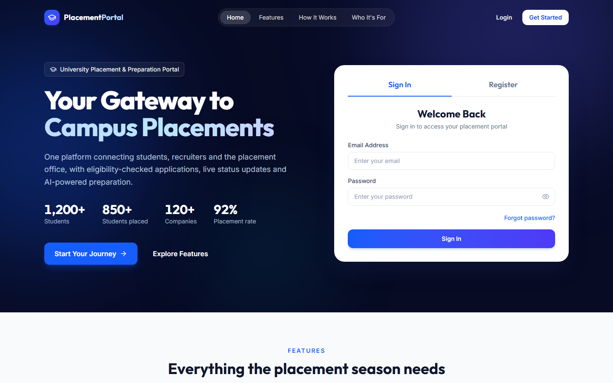

---

## Contents

- [Features](#features)
- [Screenshots](#screenshots)
- [Tech stack](#tech-stack)
- [Architecture](#architecture)
- [Project structure](#project-structure)
- [Getting started](#getting-started)
- [Environment variables](#environment-variables)
- [API overview](#api-overview)
- [Security](#security)
- [How the AI features work](#how-the-ai-features-work)
- [Deployment](#deployment)

---

## Features

### Student
- Register with email OTP verification; forgot / reset password by OTP
- Profile with academics, skills, projects, experience, certificates and a profile photo
- **Quick setup from a LinkedIn PDF**: the AI fills the form; the student reviews and saves
- Resume upload (PDF, stored privately) with **AI resume review**: a score out of 100 with a five-part breakdown, strengths, missing skills and improvement tips
- Job listings with a live **eligibility check** (CGPA, branch, batch) and preferred-skill match
- One-click apply with an optional cover letter; application timeline (applied → shortlisted → interview → selected / rejected)
- In-app notifications for every status change
- Placement drives and announcements
- **Timed mock tests** (aptitude, technical, coding) with server-side timer and answer review
- **AI mock interview**: five role-based questions with feedback on every answer and a final report
- **AI interview prep**: tips, topics to revise and common questions with hints for a chosen role
- **AI placement assistant** (chatbot) that answers using the student's own profile, scores and applications

### Recruiter
- Registers with company details; can log in only after the TPO approves the account
- Posts jobs with eligibility rules; every new or edited job waits for TPO approval
- Reviews applicants (profile, skills match, resume, cover letter) and moves them through the hiring stages
- **AI match score** for an applicant against the job (advice only; name, email and phone are never sent to the AI)
- Private notes on each applicant

### Placement Office (Admin)
- Approves or removes recruiters, approves or rejects jobs (with a reason)
- Student directory with search and filters, full student profiles and resumes
- Placement drives with schedules (students are notified), and targeted announcements with expiry dates
- Creates and publishes mock tests
- **Analytics dashboard**: total students, placed students, placement rate, department-wise and company-wise placement charts, filterable by batch

---

## Screenshots

> Screenshots were taken on the live site with temporary sample data, which was deleted afterwards.

| Student dashboard with AI resume insights | Job listings with eligibility |
|---|---|
| 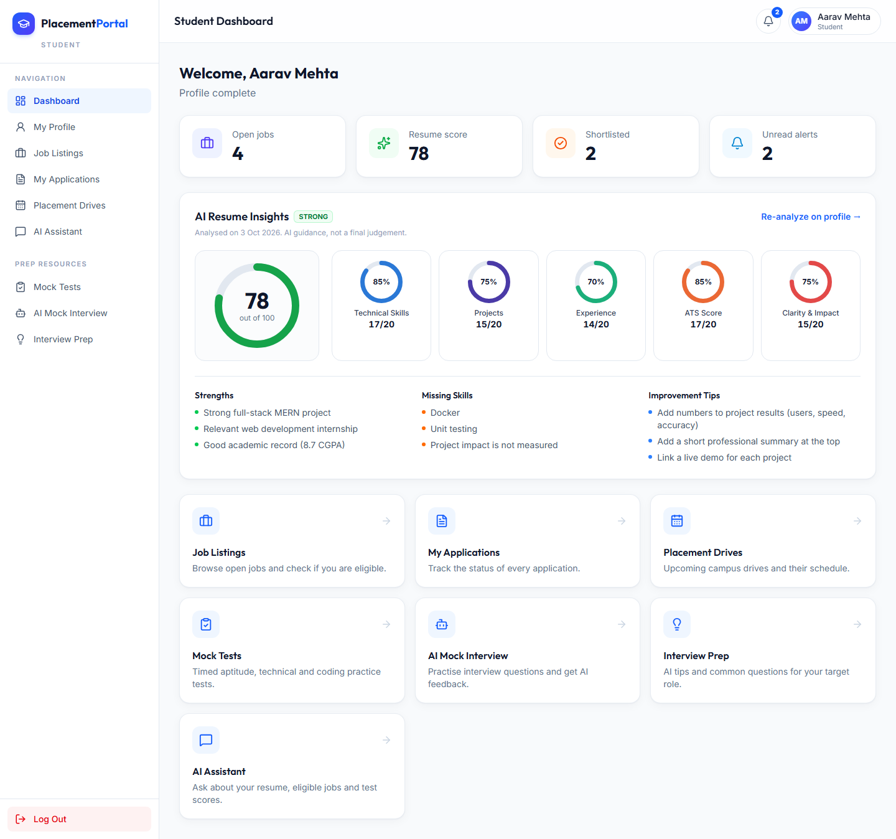 | 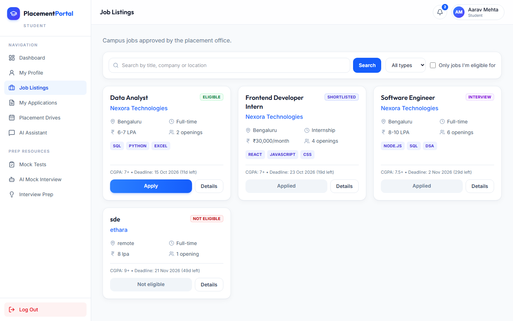 |

| Application tracking | Mock tests |
|---|---|
| 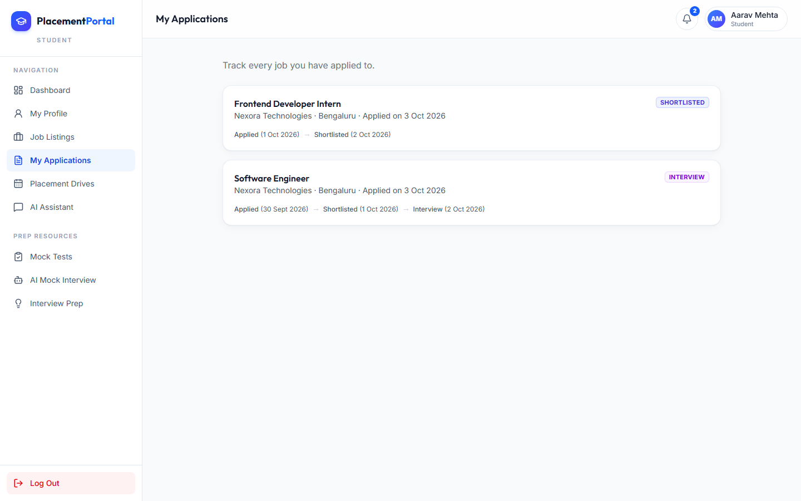 | 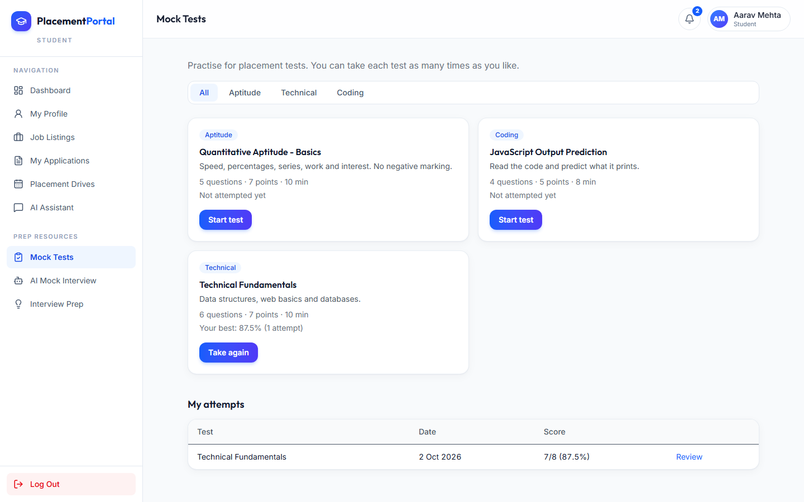 |

| AI placement assistant | AI interview prep |
|---|---|
| 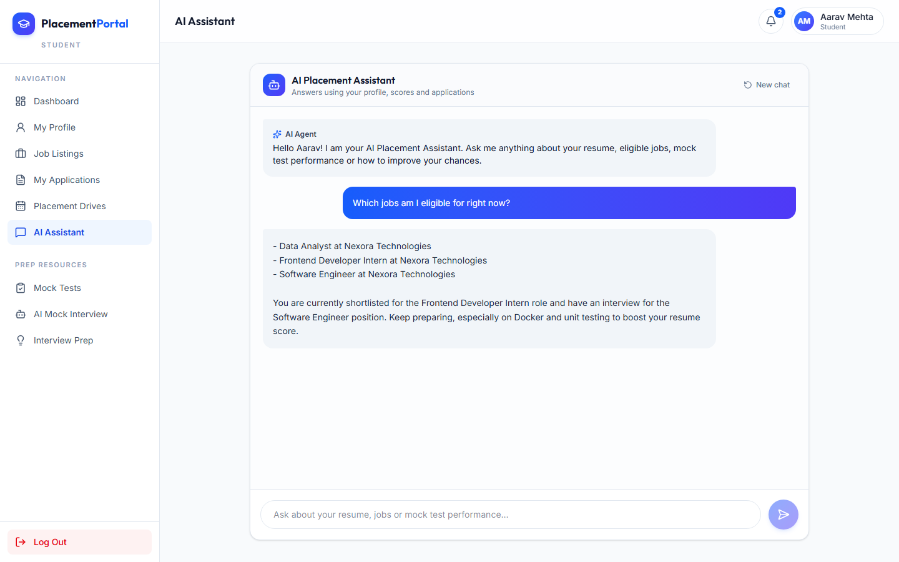 | 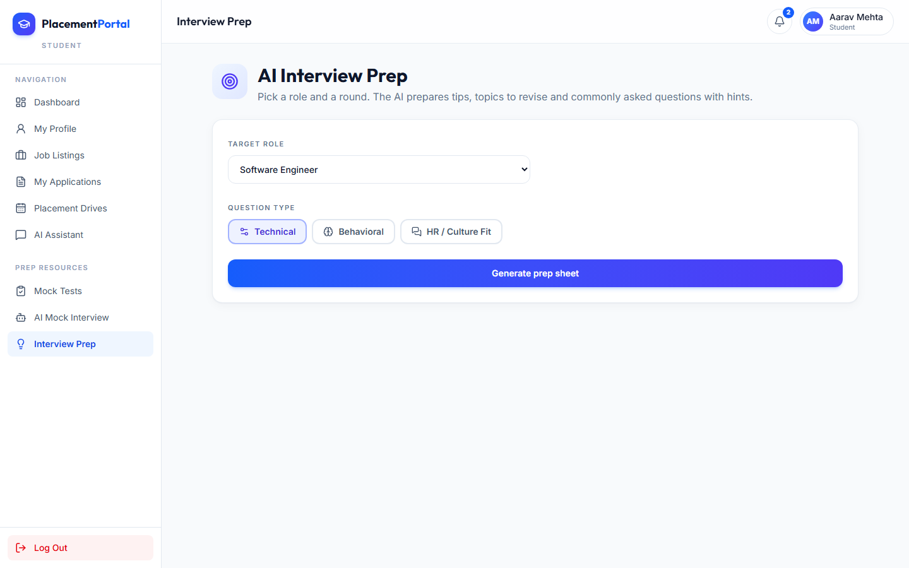 |

| Admin analytics dashboard | Recruiter applicant review |
|---|---|
| 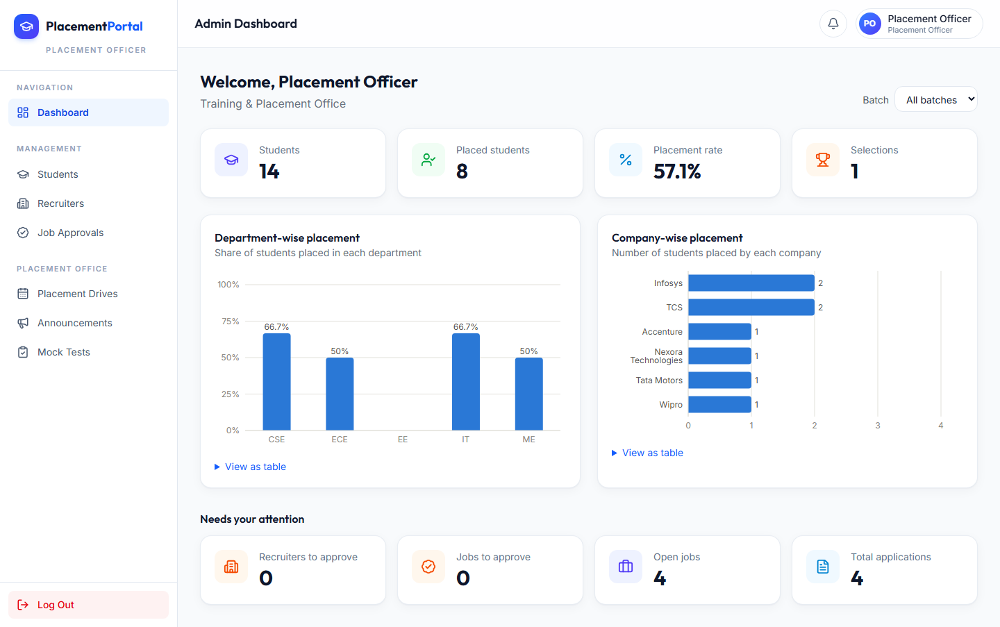 | 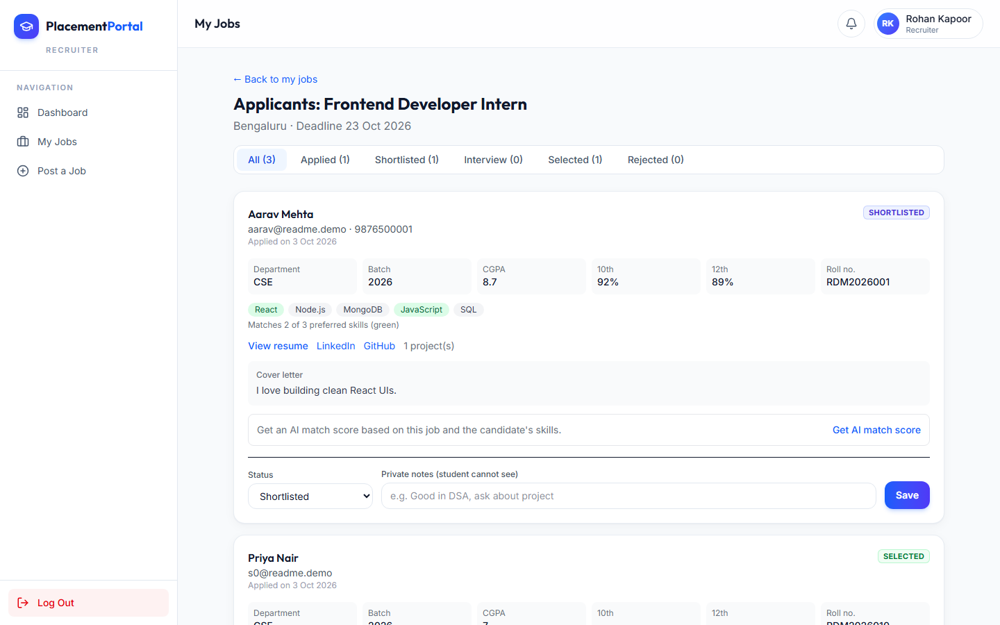 |

| Admin student directory | Login |
|---|---|
| 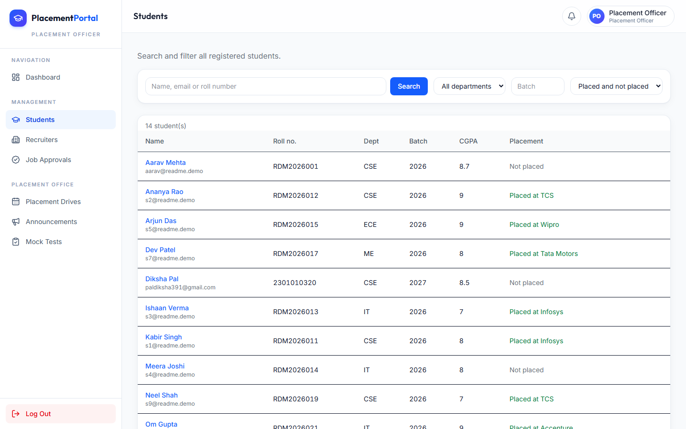 | 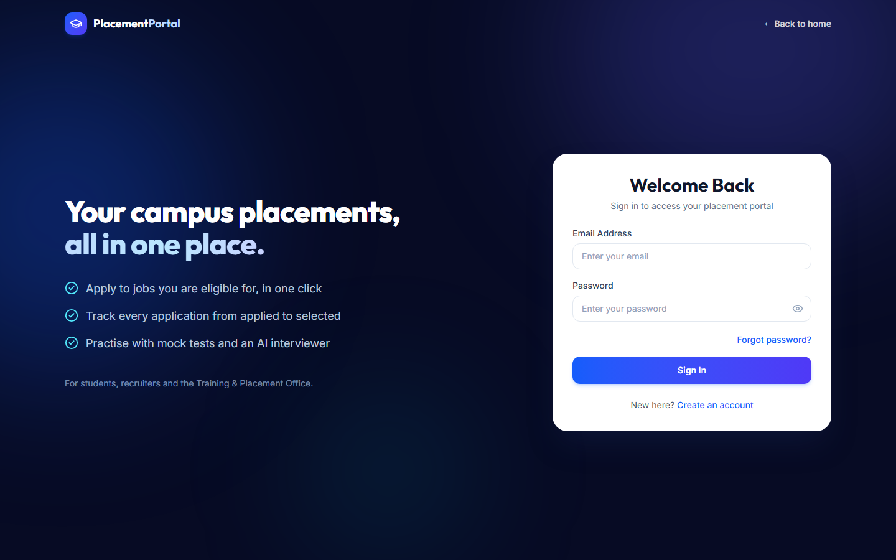 |

<p align="center">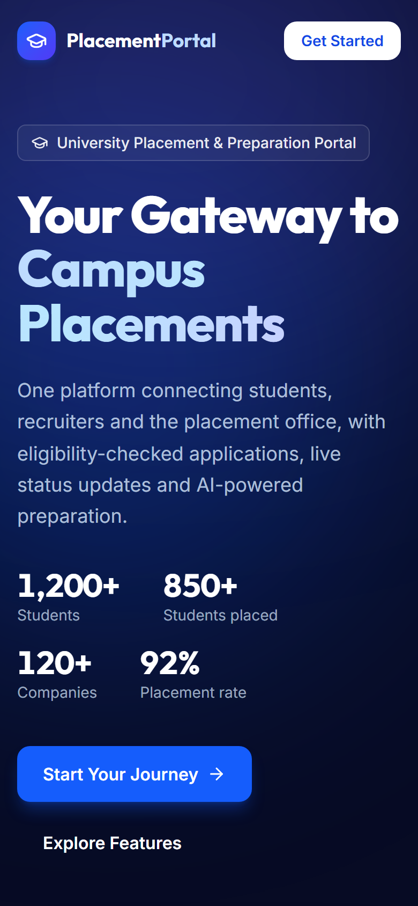</p>
<p align="center"><em>Responsive mobile layout</em></p>

---

## Tech stack

| Layer | Technology |
|---|---|
| Frontend | React 19 (Vite), React Router, Tailwind CSS v4, Axios, react-hot-toast, Recharts, lucide-react |
| Backend | Node.js, Express 5, Mongoose 9 |
| Database | MongoDB Atlas |
| Auth | JWT, bcrypt, role-based access control middleware, email OTP |
| Files | Multer (memory storage), Cloudinary (private resumes, public photos), pdf-parse |
| AI | Any OpenAI-compatible API (OpenRouter free models by default), with model fallback |
| Email | Nodemailer + Gmail locally, Brevo HTTP API in production |
| Security | helmet, express-rate-limit, CORS allow-list, input validation on every route |
| Hosting | Vercel (frontend), Render (backend) |

---

## Architecture

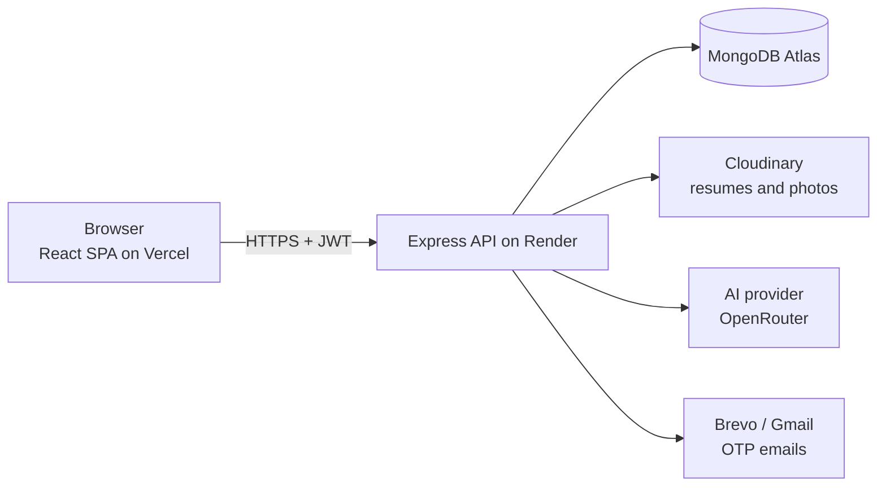

- The React app talks to the API through one Axios instance that adds the JWT to every request and logs the user out on a 401.
- Every API route checks the token (`protect`) and the role (`authorize('admin')` and so on). Frontend route guards exist only for a better experience; the real checks are on the server.
- Business rules (eligibility, deadlines, one application per job, mock test timing and scoring) are all enforced on the server.

---

## Project structure

```
University/
├── client/                     React frontend (Vite)
│   ├── src/
│   │   ├── components/         Layout, form inputs, cards, charts, student/recruiter/admin widgets
│   │   ├── context/            AuthContext (logged-in user, login, logout)
│   │   ├── pages/              auth/, student/, recruiter/, admin/, Landing
│   │   ├── services/api.js     Axios instance with JWT interceptor
│   │   └── utils/              constants, formatting, profile completion, resume opener
│   └── vercel.json             SPA rewrite so deep links work on refresh
├── server/                     Express backend
│   ├── config/                 MongoDB, Cloudinary, shared constants
│   ├── controllers/            Route handlers (auth, student, recruiter, admin, jobs, AI, tests ...)
│   ├── middleware/             auth.js, roleCheck.js, upload.js, errorHandler.js
│   ├── models/                 User, Job, Application, Notification, OTP, PlacementDrive,
│   │                           Announcement, MockTest, MockTestAttempt, MockInterview
│   ├── routes/                 One router per area
│   ├── services/               aiService, emailService, otpService, storageService, pdfService,
│   │                           notificationService, placementService, scoringService
│   ├── scripts/                seedAdmin.js, seedMockTests.js
│   ├── utils/                  AppError, eligibility, validation, dates, rate limiter
│   └── server.js               App setup: security, CORS, rate limits, routes
└── docs/screenshots/           Images used in this README
```

---

## Getting started

### Prerequisites
- Node.js 20 or newer
- A MongoDB Atlas cluster (free M0 is enough)
- A Cloudinary account (free)
- A Gmail account with an App Password (for OTP emails locally)
- An OpenRouter API key (free) for the AI features

### 1. Clone and install
```bash
git clone https://github.com/diksha12345612/University-Placement-Portal.git
cd University-Placement-Portal

cd server && npm install
cd ../client && npm install
```

### 2. Configure environment variables
```bash
cp server/.env.example server/.env
cp client/.env.example client/.env
```
Fill in the values described in [Environment variables](#environment-variables).

### 3. Create the admin account and sample tests
```bash
cd server
npm run seed:admin    # creates the TPO account from ADMIN_* in .env
npm run seed:tests    # optional: three sample mock tests
```

### 4. Run
```bash
# terminal 1
cd server && npm run dev      # http://localhost:5000

# terminal 2
cd client && npm run dev      # http://localhost:5173
```
Log in as the admin with the `ADMIN_EMAIL` / `ADMIN_PASSWORD` you set, or register as a student or recruiter.

---

## Environment variables

### `server/.env`
| Variable | Description |
|---|---|
| `PORT` | API port (local: `5000`) |
| `NODE_ENV` | `development` or `production` |
| `CLIENT_URL` | Allowed frontend origins, comma separated |
| `MONGO_URI` | MongoDB Atlas connection string |
| `JWT_SECRET`, `JWT_EXPIRES_IN` | Token signing secret and lifetime (e.g. `7d`) |
| `CLOUDINARY_CLOUD_NAME`, `CLOUDINARY_API_KEY`, `CLOUDINARY_API_SECRET` | Cloudinary credentials |
| `EMAIL_USER`, `EMAIL_PASS`, `EMAIL_FROM_NAME` | Gmail address and App Password (local email) |
| `BREVO_API_KEY`, `EMAIL_FROM` | Brevo key and verified sender (production email) |
| `AI_BASE_URL`, `AI_API_KEY`, `AI_MODEL` | OpenAI-compatible endpoint, key and model id(s); several models can be listed, comma separated, as fallbacks |
| `ADMIN_NAME`, `ADMIN_EMAIL`, `ADMIN_PASSWORD` | Used only by `npm run seed:admin` |

If the Gmail variables are empty in development, emails are printed in the terminal instead of being sent.

### `client/.env`
| Variable | Description |
|---|---|
| `VITE_API_URL` | Backend base URL, e.g. `http://localhost:5000/api` |

---

## API overview

All routes are under `/api`. Protected routes need `Authorization: Bearer <token>`.

| Area | Main routes | Who |
|---|---|---|
| Auth | `POST /auth/register`, `/verify-email`, `/resend-otp`, `/login`, `/forgot-password`, `/reset-password`, `GET /auth/me` | Public / any user |
| Student profile | `GET/PUT /students/profile`, `POST/GET/DELETE /students/resume`, `POST /students/resume/analyze`, `POST/DELETE /students/photo`, `POST /students/linkedin-import` | Student |
| Jobs & applications | `GET /jobs`, `GET /jobs/:id`, `POST /jobs/:id/apply`, `GET /applications/me`, `DELETE /applications/:id` | Student |
| Recruiter | `POST/GET /recruiter/jobs`, `PUT /recruiter/jobs/:id`, `PATCH /recruiter/jobs/:id/active`, `GET /recruiter/jobs/:id/applications`, `PATCH /recruiter/applications/:id`, `GET .../resume`, `POST .../ai-evaluate` | Recruiter |
| Admin | `/admin/stats`, `/admin/students`, `/admin/recruiters`, `/admin/jobs`, `/admin/drives`, `/admin/announcements`, `/admin/mock-tests` | Admin |
| Preparation | `GET /mock-tests`, `POST /mock-tests/:id/start`, `POST /mock-tests/attempts/:id/submit`, `/interviews`, `/assistant/chat`, `/assistant/interview-prep` | Student |
| Shared | `GET /notifications`, `PATCH /notifications/:id/read`, `GET /drives`, `GET /announcements` | Any user |

Errors always have the same shape: `{ "success": false, "message": "..." }`.

---

## Security

- Passwords and OTPs are hashed with bcrypt; OTPs expire through a MongoDB TTL index and allow five attempts
- JWT authentication plus role checks on every protected route; recruiters are blocked until approved
- Mass-assignment protection: only whitelisted fields are taken from request bodies (a student cannot mark themselves "placed", a recruiter cannot approve their own job)
- Ownership checks: recruiters only see applicants of their own jobs; students only see their own data
- Resumes are private Cloudinary files served through short-lived signed URLs
- Uploads are checked by file type **and** file content ("magic numbers"), with size limits
- Unique indexes stop duplicate applications and duplicate in-progress test attempts, even with simultaneous requests
- `helmet` security headers, rate limiting on login/OTP routes and the whole API, and a CORS allow-list
- Mock test answers never reach the browser before submission; the timer is enforced by the server

---

## How the AI features work

All AI calls go through one function in [`server/services/aiService.js`](server/services/aiService.js) that talks to any OpenAI-compatible API and expects a JSON reply.

- **Safe output:** every score is clamped to its range, lists are length-limited and labels must match fixed values, so a bad AI reply can never break the app.
- **Prompt-injection guard:** text written by users (resumes, cover letters, answers) is wrapped in `<<< >>>` and the model is told to treat it only as data.
- **Fairness and privacy:** the recruiter match score never sends the candidate's name, email or phone number.
- **Grounded answers (RAG-style):** the assistant first collects the student's own data (profile, resume score, tests, applications, eligible jobs) and gives it to the model, so answers are based on facts instead of guesses.
- **Free-tier friendly:** model fallback when a model is busy, caching of interview-prep sheets, and per-user rate limits.
- **Human in the loop:** AI results are advice. Recruiters make the hiring decision, and LinkedIn imports only fill the form until the student saves.

---

## Deployment

| Part | Platform | Key settings |
|---|---|---|
| Backend | Render (Web Service, free) | Root directory `server`, build `npm install`, start `npm start`, health check `/api/health`, environment variables from `server/.env` with `NODE_ENV=production`, `CLIENT_URL` set to the Vercel URL, Brevo keys instead of Gmail |
| Frontend | Vercel | Root directory `client`, framework Vite, `VITE_API_URL=https://<render-app>.onrender.com/api` |
| Database | MongoDB Atlas | Network access `0.0.0.0/0` so Render can connect |

Render's free plan blocks outgoing SMTP, which is why production email uses Brevo's HTTP API.

---

## License

Released under the [MIT License](LICENSE).

Built as a final-year major project.
